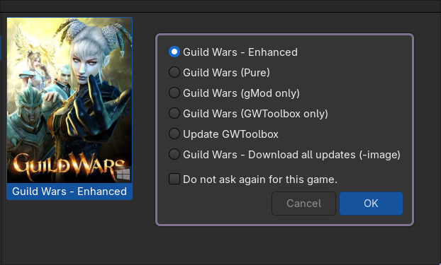

# Guild Wars - Lutris Installer

This project provides a Lutris installer script for the game "Guild Wars". It is designed to automate the installation and configuration process, making it easier for users to get started with the game on Linux systems.

## Features

- [gMod](https://github.com/gwdevhub/gMod) - allows to load player modifications
    - [Borderless_Cartography_Made_Easy_2015_1.3.tpf](https://wiki.guildwars.com/wiki/Player-made_Modifications/Cartography_Index) is loaded by default
    - [Minimalus_UI_v2.1.tpf](https://wiki.guildwars.com/wiki/User:Jujin/Minimalus_UI_Mod) is installed but not loaded by default (learn more below)
- [GWToolbox](https://www.gwtoolbox.com/) - a collection of several tools and enhancements for the original Guild Wars
- [ChatFilter](https://guildwarslegacy.com/forum/thread/2956-chat-filter-filter-out-gold-spammers/) - filter out gold spammers
- [Multiple launchers available](#launchers) - choose your preferred launcher when starting the game

<center>


</center>

## Usage

### Manual Installation

1. Install [Lutris](https://lutris.net/)
2. Download [Guild Wars Enhanced installer](https://mangelmaxime.github.io/guild-wars-enhanced-lutris/scripts/guild-wars-enhanced.yml)
3. Install the game using Lutris:
   - Open Lutris
   - Click on the "+" button to add a new game
   - Select **Install from a local install script**
   - Follow the instructions
4. You are ready to play! *but* we recommend you to do the following steps:
    - Click on **Close** instead of **Launch** when the installation is complete
    - Run the game and choose **Guild Wars - Download all updates (-image)**

        *This will download all updates so you don't have to download them later when playing*

    - Once the game is updated, you can run it again and choose one of the launchers to play the game

### Automatic Installation

First ensure that [Lutris](https://lutris.net/) and `curl` are installed on your system. Then execute:

```bash
curl -fsSL https://mangelmaxime.github.io/guild-wars-enhanced-lutris/scripts/install.sh | bash
```

## Launchers

This installer provides several launchers to choose from, allowing you to customize your experience.

| Launcher                                   | Default | Description                                                                                      |
| ------------------------------------------ | :-----: | ------------------------------------------------------------------------------------------------ |
| Guild Wars (Full Enhanced)                 |   ✅    | Full experience with gMod, Cartography Made Easy and GWToolblox enabled                          |
| Guild Wars (Pure)                          |         | Just the standard game                                                                           |
| Guild Wars (gMod only)                     |         | Only gMod enabled with Cartography Made Easy loaded                                              |
| Guild Wars (GWToolbox only)                |         | Only GWToolbox enabled                                                                           |
| Update GWToolbox                           |         | Update GWToolbox to the latest version                                                           |
| Guild Wars - Download all updates (-image) |         | Download all updates for the game so you don't have to download them later when you run the game |

## Configure `gMod`

By default, only `Borderless_Cartography_Made_Easy_2015_1.3.tpf` is loaded.

If you want to load the `Minimalus_UI_v2.1.tpf`, you can do so by following these steps:

1. Go to your installation directory, usually:

    - `/home/your-username/Games/guild-wars-enhanced`
    - `$HOME/Games/guild-wars-enhanced`

    You can also Right Click on the game in Lutris and select **Browse Files**.

2. Navigate to `drive_c/gMod`
3. Open `modlist.txt` in a text editor
4. Add `C:\gMod\Minimalus_UI_v2.1.tpf` to the file
5. Save the file
6. You can now launch the game with one of the launchers that enables gMod

> [!NOTE]
> You can load more mods by adding their `.tpf` files to the `gMod` directory and updating the `modlist.txt` file accordingly.
